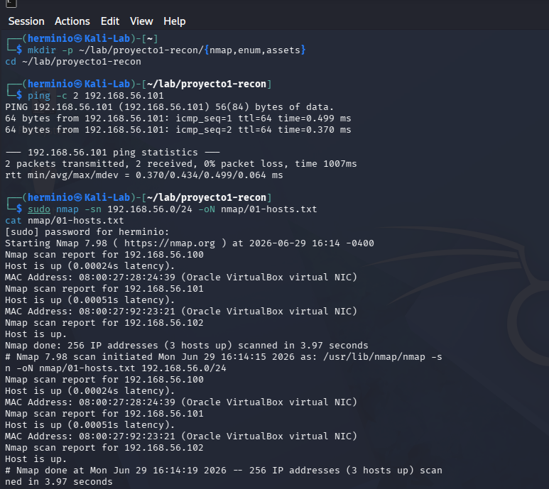
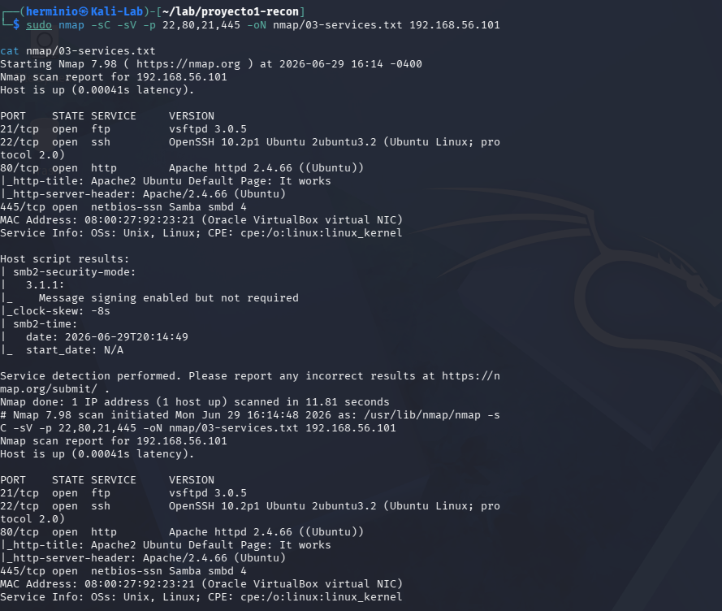
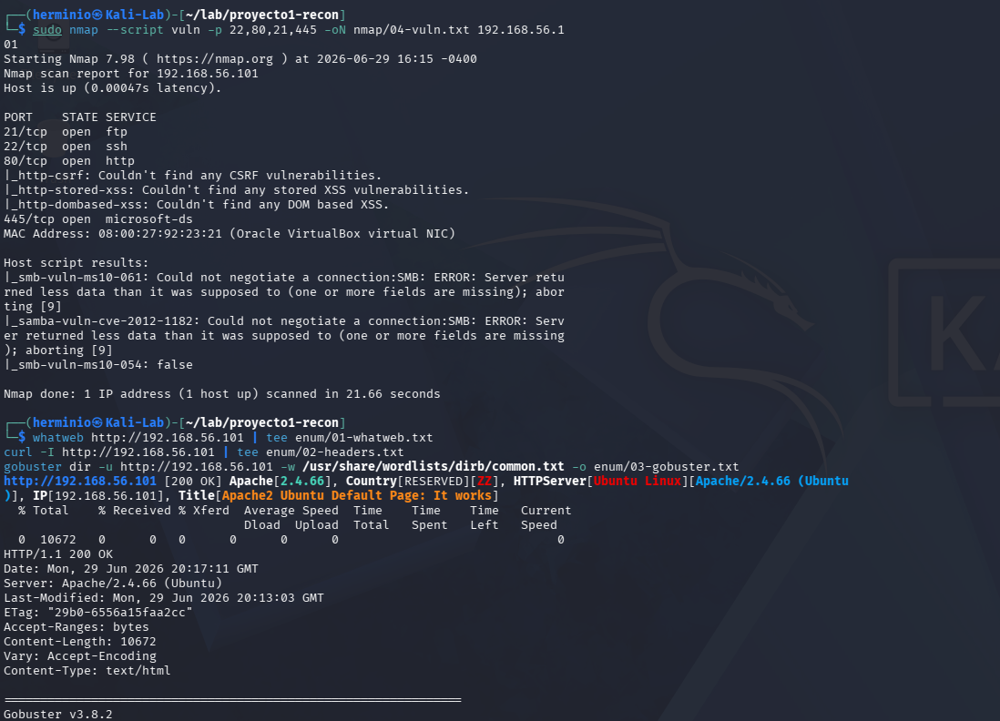
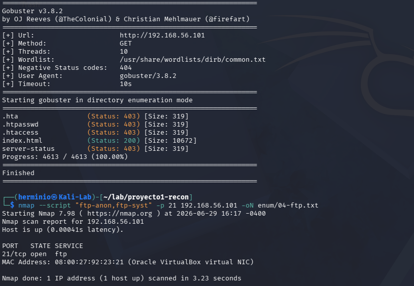
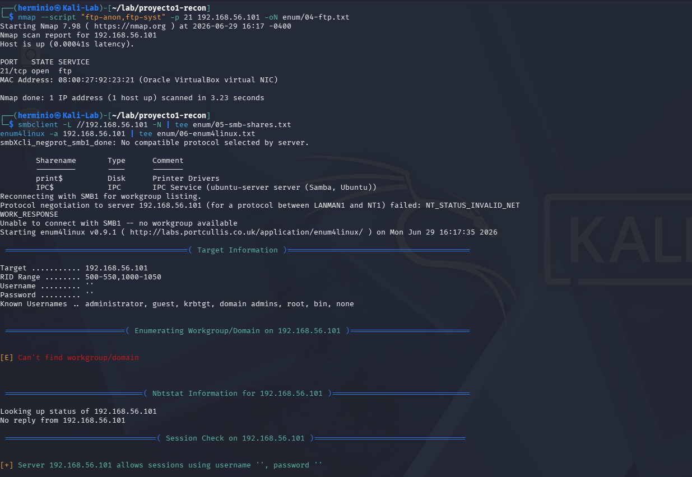
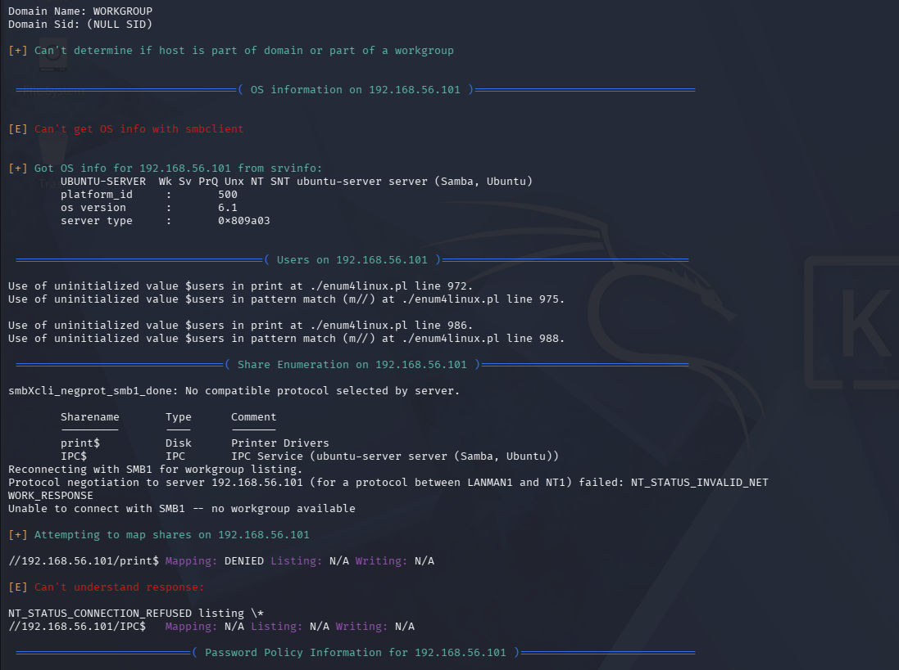
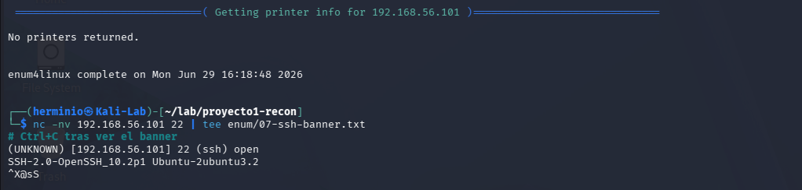

# cybersecurity-portfolio
Hands-on labs and writeups -  penetration testing &amp; offensive security


# Project 1 — Recon and Enumeration of an Ubuntu Server
 
First lab in my portfolio. I run the full recon flow against a Linux server with common services exposed, then document what I find and how to fix it.
 
| Field | Value |
|-------|-------|
| Attacker | Kali Linux (192.168.56.x) |
| Target | Ubuntu Server 24.04 (192.168.56.101) |
| Network | VirtualBox Host-Only |
| Tools | nmap, whatweb, gobuster, enum4linux, smbclient, netcat |
| Date | 2026-06-29 |
 
## Summary
 
I walk through host discovery, a full TCP port scan, version detection, and per-service enumeration. The box is patched, so I don't expect exploitable CVEs. I do expect to leak useful information, and I find some.
 
## 1. Lab setup
 
On Ubuntu I install four common services so I have something to scan:
 
```bash
sudo apt update
sudo apt install -y openssh-server apache2 vsftpd samba
sudo systemctl enable --now ssh apache2 vsftpd smbd
```
 
Then I grab the IP:
 
```bash
ip a
# enp0s8: 192.168.56.101/24
```
 
From Kali I check I can reach the box:
 
```bash
ping -c 2 192.168.56.101
```
 
## 2. Host discovery
 
```bash
sudo nmap -sn 192.168.56.0/24 -oN nmap/01-hosts.txt
```
 
I see `192.168.56.101` alive on the Host-Only subnet.
 

 
## 3. Full TCP port scan
 
```bash
sudo nmap -p- --min-rate 5000 -oN nmap/02-allports.txt 192.168.56.101
```
 
Open ports:
 
| Port | Service |
|------|---------|
| 21/tcp | FTP |
| 22/tcp | SSH |
| 80/tcp | HTTP |
| 139/tcp | NetBIOS-SSN |
| 445/tcp | SMB (microsoft-ds) |
 

 
## 4. Service and version detection
 
```bash
sudo nmap -sC -sV -p 21,22,80,139,445 -oN nmap/03-services.txt 192.168.56.101
```
 
Versions:
 
- SSH: OpenSSH 10.2p1 (Ubuntu 2ubuntu3.2)
- HTTP: Apache 2.4.66 (Ubuntu)
- FTP: vsftpd
- SMB: Samba (microsoft-ds)
## 5. Vulnerability scripts
 
```bash
sudo nmap --script vuln -p 22,80,21,445 -oN nmap/04-vuln.txt 192.168.56.101
```
 
Legacy SMB scripts fail to negotiate. Modern Samba refuses SMBv1, which is what those scripts target. No findings, expected for a patched box.
 

 
## 6. Manual enumeration per service
 
### HTTP (port 80)
 
```bash
whatweb http://192.168.56.101 | tee enum/01-whatweb.txt
curl -I http://192.168.56.101 | tee enum/02-headers.txt
gobuster dir -u http://192.168.56.101 -w /usr/share/wordlists/dirb/common.txt -o enum/03-gobuster.txt
```
 
`whatweb` confirms Apache 2.4.66 on Ubuntu Linux. Gobuster only returns the default Apache pages (`index.html`, `.htaccess` protected with 403). Nothing custom on the web root.
 

 
### FTP (port 21)
 
```bash
nmap --script "ftp-anon,ftp-syst" -p 21 192.168.56.101
```
 
Anonymous login off. Nothing accessible without credentials.
 
### SMB (port 445)
 
```bash
smbclient -L //192.168.56.101 -N | tee enum/05-smb-shares.txt
enum4linux -a 192.168.56.101 | tee enum/06-enum4linux.txt
```
 
`smbclient` lists two shares: `print$` and `IPC$`. The interesting bit comes from `enum4linux`.
 

 
`enum4linux` pulls OS info and local users without credentials:
 
- OS: Ubuntu Server, Samba 6.1
- Users: `UBUNTU-SERVER\nobody`, `Unix User\herminio`
Having a valid username opens the door to SSH brute force, password spraying, and phishing.
 

 
### SSH (port 22)
 
```bash
nc -nv 192.168.56.101 22
# SSH-2.0-OpenSSH_10.2p1 Ubuntu-2ubuntu3.2
```
 
Current OpenSSH. No public CVEs at the time of the lab.
 

 
## 7. Findings and risk
 
| # | Finding | Severity | Why it matters |
|---|---------|----------|----------------|
| 1 | SMB allows anonymous user enumeration | Medium | Leaks valid usernames for credential attacks |
| 2 | Apache shows the default page | Low | Confirms stack and version to the attacker |
| 3 | FTP and SMB exposed without a use case | Medium | Bigger attack surface than needed |
 
## 8. Mitigations
 
Block anonymous SMB enumeration. In `/etc/samba/smb.conf` under `[global]`:
 
```
restrict anonymous = 2
server min protocol = SMB3
```
 
Restart Samba:
 
```bash
sudo systemctl restart smbd
```
 
Drop the Apache banner. In `/etc/apache2/conf-enabled/security.conf`:
 
```
ServerTokens Prod
ServerSignature Off
```
 
Close FTP if you don't use it:
 
```bash
sudo systemctl disable --now vsftpd
sudo apt purge -y vsftpd
```
 
Harden SSH in `/etc/ssh/sshd_config`:
 
```
PermitRootLogin no
PasswordAuthentication no
```
 
Set up a key first before disabling password auth, or you lock yourself out.
 
## 9. What I took away
 
The patched box gave me no easy win on CVEs, but I still pulled a valid username through Samba. That is the whole point of recon: not finding a flag in the first hour, but building the picture an attacker would build.
 
I also learned that I lean too hard on default `nmap --script vuln`. Most of its checks target old Windows boxes. For Linux targets I should focus on service-specific scripts and manual enumeration instead.
 
## 10. Files in this project
 
```
proyecto1-recon/
├── README.md
├── nmap/
│   ├── 01-hosts.txt
│   ├── 02-allports.txt
│   ├── 03-services.txt
│   └── 04-vuln.txt
├── enum/
│   ├── 01-whatweb.txt
│   ├── 02-headers.txt
│   ├── 03-gobuster.txt
│   ├── 04-ftp.txt
│   ├── 05-smb-shares.txt
│   ├── 06-enum4linux.txt
│   └── 07-ssh-banner.txt
└── assets/
    ├── 01-host-discovery.png
    ├── 02-allports.png
    ├── 03-vuln-whatweb.png
    ├── 04-gobuster.png
    ├── 05-enum4linux-start.png
    ├── 06-enum4linux-users.png
    └── 07-ssh-banner.png
```
 
## References
 
- [HackTricks - Pentesting Network](https://book.hacktricks.xyz/network-services-pentesting)
- [HackTricks - SMB](https://book.hacktricks.xyz/network-services-pentesting/pentesting-smb)
- [Nmap Scripting Engine](https://nmap.org/book/nse.html)

 
